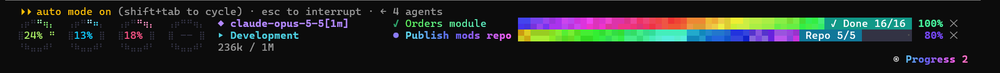

# claude-code-mods

Stylish HUD mods for the Claude Code terminal, drawn under the prompt.



```
⢠⡶⠛⠛⢶⡄ ⢠⡶⠛⠛⢶⡄ ⢠⡶⠛⠛⢶⡄ ⢠⡶⠛⠛⢶⡄  ◆ claude-opus-5-5[1m] ▰▰▰▱▱ high   ✓ Orders module ▰▰▰▰▰▰▰▰▰▰ ✓ Done 16/16 100% ✕
⣿ 17%⣿ ⣿  8%⣿ ⣿ 18%⣿ ⣿ -- ⣿  ▸ my-project
⠘⠷⣤⣤⠾⠃ ⠘⠷⣤⣤⠾⠃ ⠘⠷⣤⣤⠾⠃ ⠘⠷⣤⣤⠾⠃  175k / 1M
```

| Plugin | What it draws |
| --- | --- |
| **limit-bars** | Four braille rings, filled clockwise with the percentage inside: **context** (green → amber → red), **session** 5-hour limit (cyan → violet), **weekly** limit (pink → orange) and **Fable** weekly limit (mint → blue). A light orbits each filled arc; a ring pulses red past 80% (context) or 90% (limits). Beside them: model with its effort level (a five-step meter, low → max), workspace folder and tokens used. |
| **plan-progress-fx** | Animated rainbow progress bars for multi-step tasks, with gradient titles and percentages, placed to the right of the rings. On a narrow terminal they stay collapsed until you open them with **◉ Progress**, and then take the rings' place. |

Both work alone; together they share the line.

## Install

Requires a Claude Code build with plugin hooks (`ui.render`).

```sh
claude plugin marketplace add LegendSilvia/claude-code-mods
claude plugin install limit-bars@claude-code-mods
claude plugin install plan-progress-fx@claude-code-mods
```

Restart Claude Code. If you use a `statusLine` command in `settings.json` that shows the model, folder or context, you can remove it: limit-bars shows the same.

### Notes

- The rate-limit rings fill in after the first reply of a session (Claude Code learns the limits from API responses) and only on a subscription account. A limit your account doesn't report shows `--`.
- The Fable ring reads the weekly window whose name contains `fable`, or any other model-specific weekly window.
- The rings and animation need the terminal; the desktop app gets pie glyphs (`○ ◔ ◑ ◕ ●`) instead.

### plan-progress-fx commands

| Command | Does |
| --- | --- |
| `/progress` | Show or hide the bars |
| `/progress-demo` | Run a sample plan |
| `/progress-sounds` | Play the decision, error and done sounds |
| `/progress-clear` | Remove all bars |

## Develop

```sh
claude plugin validate plugins/limit-bars
claude plugin test plugins/limit-bars
claude plugin test plugins/plan-progress-fx
```

## License

MIT. `plan-progress-fx` is a fork of [plan-progress](https://github.com/zycck/claude-mods) by Kirill Serditov (MIT); see its [LICENSE](plugins/plan-progress-fx/LICENSE).
